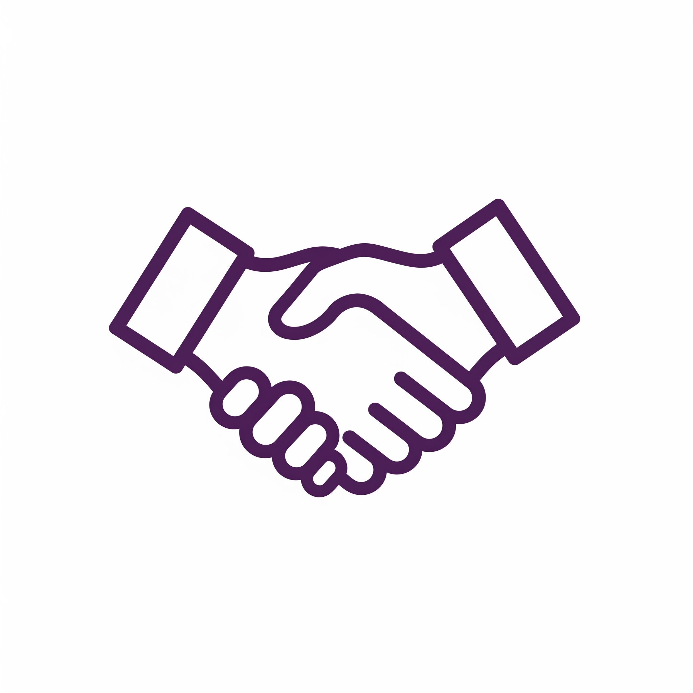

<!--
Если logo.png лежит в той же папке (profile), что и этот README.md,
достаточно просто указать имя файла в src.
-->

<h1>Пайванд - адресная помощь</h1>

## 🚀 Кто мы?

Мы — команда из более чем 10 волонтеров-энтузиастов. Мы не корпорация и не государственное учреждение. Мы — разработчики, дизайнеры и менеджеры, которых объединила одна острая проблема и одна большая идея.

Мы видим, что желание помочь часто разбивается о стену непонимания: кому помочь? что именно нужно? дойдет ли помощь? Мы создаем цифровой мост, который сделает благотворительность в Таджикистане прозрачной, точечной и эффективной.

## 🛠 Текущий статус: Active Development 🚧

Прямо сейчас мы находимся в активной фазе разработки MVP (Minimum Viable Product). Мы строим платформу, которая позволит социальным учреждениям публиковать свои реальные потребности, а донорам — закрывать их в пару кликов.

## Наш технический стек:

Frontend: Next.js (React), Tailwind CSS

Backend: Go (Golang)

Infrastructure: Docker, CI/CD

## 🤝 Хотите присоединиться?

Наши репозитории пока закрыты (Private) для обеспечения безопасности данных на этапе разработки, но мы всегда открыты для новых талантов.

Если вы разделяете наши ценности и хотите внести свой вклад в развитие социального Tech-проекта, напишите нам. Нам всегда нужны:

Frontend & Backend разработчики

QA инженеры

UI/UX дизайнеры

## 📞 Контакты

По всем вопросам сотрудничества, волонтерства или технической обращайтесь:

Контактное лицо: Хамидов Сиёвуш

GitHub: @siyovush-hamidov

Telegram: [@siyovush_hamidov](https://t.me/siyovush_hamidov)

<i>Разрабатываем с ❤️ ради общего блага.</i>

